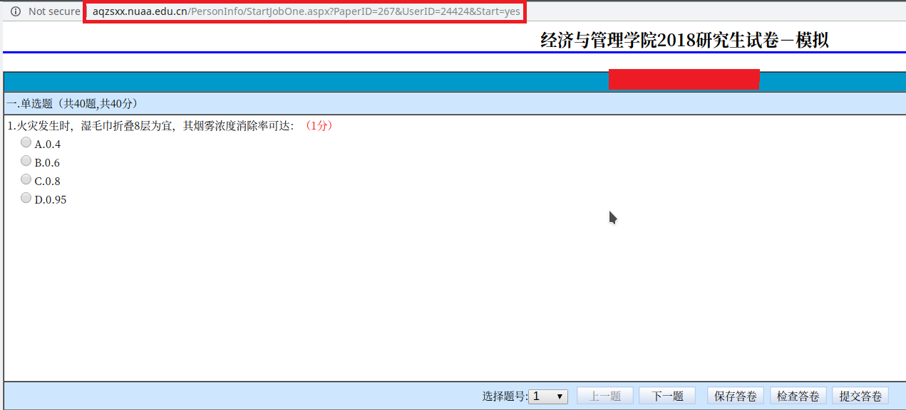

# Pass NUAA's lab examination in one minute!

## Introduction

南航的[实验室考试系统](http://aqzsxx.nuaa.edu.cn/)给研究生同学们带来了极大的困扰。尤其是要牺牲自己宝贵的学习和恋爱的时间去完成这种没有意义的考试。

因此，这个项目为解决这一问题提供解决方案。让大家能够在1分钟之内获得考试的合格证。

## Requirements

- Python version >= 3.4
- selenium
- lxml
- xlwt
- xlrd

上述软件包可通过 pip 安装，例如安装 selenium 的命令如下：
```
pip install selenium
```

## 使用方法

修改 [main.py](./main.py)下面的登录信息。填入学号，登录密码，以及考试页面的链接，即可在一分钟之内，以95分以上的成绩完成一次模拟考试。

```python
if __name__ == '__main__':
    take_exam(user_id='sx1801001',  # 学号
              password='123456',  # 密码
              ans_file='key.xls',  # 答案文件
              exam_url='http://aqzsxx.nuaa.edu.cn/PersonInfo/StartJobOne.aspx?PaperID=267&UserID=24424&Start=yes')  # 模拟考试或正式考试页面的链接
```

其中 exam_url 填入下图所示红色区域内容：


